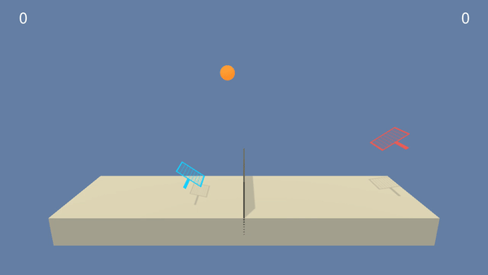

# Udacity Reinforcement Learning Collaboration and Competition Project

## Introduction
This repository is to solve the Udacity exercise, Collaboration and Competition, by the concept [Multi-Agent Actor-Critic for Mixed Cooperative-Competitive Environments](https://arxiv.org/abs/1706.02275). Instead of one agent self-play, two agents have been trained to play tennis and keep their own racket to bounce a ball over a net.

### The Environment
The state space has 24 dimensions to describe the position and velocity of the rocket and ball. Each agent receives its own, local observation. Continuous action space has 2 outputs with respect to movement toward (or away from) the net, and jumping.

If an agent hits the ball over the net, it receives a reward of +0.1. If an agent lets a ball hit the ground or hits the ball out of bounds, it receives a reward of -0.01. The task is episodic and solved if agents get an average score of +0.5 over 100 consecutive episodes.



## Getting Start

1. Download the environment from one of the links below.  You need only select the environment that matches your operating system:

    - Linux: [click here](https://s3-us-west-1.amazonaws.com/udacity-drlnd/P3/Tennis/Tennis_Linux.zip)
    - Mac OSX: [click here](https://s3-us-west-1.amazonaws.com/udacity-drlnd/P3/Tennis/Tennis.app.zip)
    - Windows (32-bit): [click here](https://s3-us-west-1.amazonaws.com/udacity-drlnd/P3/Tennis/Tennis_Windows_x86.zip)
    - Windows (64-bit): [click here](https://s3-us-west-1.amazonaws.com/udacity-drlnd/P3/Tennis/Tennis_Windows_x86_64.zip)


Please make sure each ```file_path``` in ```train_dqn.ipynb``` and ```eval.py``` available.

## Installation

1. Clone the repository and initialize the submodules.

```
git clone https://github.com/sanjuu11525/udacity_collaboration.git
cd udacity_collabroration
```

2. Install [Miniconda](https://docs.conda.io/en/latest/miniconda.html) ,JupytorLab and  create a new conda env.

```
conda create -n ENV_NAME python=3.6
conda activate ENV_NAME
pip install jupyterlab
```

3. Install the project requirements.


```
pip install -r requirements.txt
```

## Running the Code

1. This repository is for Collaboration and Competition project. Some implementation is publicly avaialble by Udacity. Please visit the reference for more information.

2. Train the agent with implemented code in ```train.ipynb```.

3. Evaluate trained models by runnung ```python eval.py```. Please turn your jupytor down when evaluating training result. Otherwise, resource conficts.

4. Pretrained models are in ```./checkpoint```.

## Reference

[1]https://github.com/udacity/deep-reinforcement-learning#dependencies
